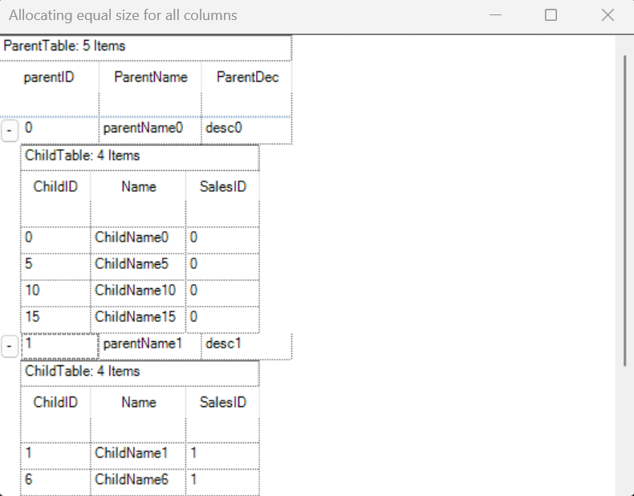

# How to resize parent grid columns to automatically adjust child grid columns in WinForms GridGroupingControl?

In [WinForms GridGroupingControl](https://help.syncfusion.com/windowsforms/gridgrouping/overview), when resizing a parent grid column, the corresponding child grid columns can also be resized based on the parent column width by using the [TableModel.ColWidthsChanging](https://help.syncfusion.com/cr/windowsforms/Syncfusion.Windows.Forms.Grid.GridModel.html#Syncfusion_Windows_Forms_Grid_GridModel_ColWidthsChanging) event. Within this event, the widths of the nested table columns can be adjusted proportionally to reflect the changes made to the parent column.

 ```csharp
//Event subscription
gridGroupingControl1.TableModel.ColWidthsChanging += OnColWidthsChanging;

//Event customization
private void OnColWidthsChanging(object sender, GridRowColSizeChangingEventArgs e)
{
    int col = e.From;
    GridTable table1 = this.gridGroupingControl1.GetTable("ChildTable");
    table1.TableModel.ColWidths[col - 1] = Convert.ToInt32(e.Values.GetValue(0));     
}
 ```

 

Take a moment to peruse the [WinForms GridGroupingControl - Columns](https://help.syncfusion.com/windowsforms/gridgrouping/managing-records-and-columns) documentation, to learn more about managing records and columns with examples.